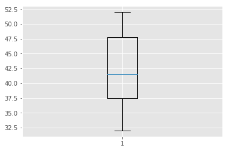
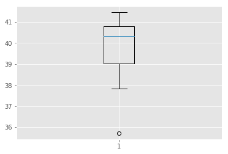

# Measures of Dispersion - Quiz
## SWBATs
* Describe the significance of calculating measures of dispersion for continuous data
* Understand the formula and intuition behind mean absolute deviation, standard deviation and variance
* Understand the formula and intuition behind quantiles/quartiles and percentiles
* Understand and interpret Interquartile distances with box plots

## Exercise 1
Summary statistics for two samples of data are
```
Sample 1:	
mean = 19 
variance = 10

Sample 2:	
mean = 10
variance = 19
```
Which sample has the larger spread of observations?


```python
# Sample 2 , variance is independant of mean values and 19 vs 10 clearly shows that sample 2 
# obswervations are more dispersed and deviate more from the mean as compared to sample 1.
```

## Exercise 2
Consider the following ordered set of data
```
4 4 4 9 5 0 5 1 5 3 5 7 5 8 6 2

6 6 6 6 6 8 7 1 7 5 7 7 8 0 8 5
```

* What is the IQR? 
* Optional extension: Verify your answer in Python 


```python
# Q1 = 7, Q2 = 4 , IQR = 3

# Following is a verification in numpy

import numpy as np
x = np.array([4 ,4, 4, 9, 5, 0, 5, 1, 5, 3, 5, 7, 5, 8, 6, 
              2, 6, 6, 6, 6, 6, 8, 7, 1, 7, 5, 7, 7, 8, 0, 8, 5,])
q75, q25 = np.percentile(x, [75 ,25])
iqr = q75 - q25
q75, q25, iqr
```


    (7.0, 4.0, 3.0)


### Exercise 3
Create a box-and-whisker plot for the judges' scores for an artist's performances in a talent competition.

```
Evan L	52
Nicole S  50
Pamela A  47
Chad O	44
Erin A	39
Jake P	38
Niecy N   36
Kate G	32
```
Create a box plot in matplotlib to identify the median for giving a final score to the artist. Are there any outliers ?


```python
import matplotlib.pyplot as plt
plt.style.use('ggplot')
x = [52,50,47,44,39,38,36,32]
plt.boxplot(x)
plt.show()
```





```python
# The median is around 41.5 and there are no outliers here.
```

### Exercise 4
Imagine that the number of marriages registered over a 10 year period were as follows:

Table 1.  Number of registered marriages
```
Year  Number of marriages

1	40,650
2	40,812
3	41,300
4	41,450
5	39,594
6	40,734
7	39,993
8	38,814
9	37,828
10   35,716
```
Using the data above:

####  Find the median 


```python
# 40,321
```

#### Find the upper and lower quartiles


```python
# Q1 = 38.814 Q3 = 40.812 
```

#### Calculate the interquartile range


```python
# 1.998
```

#### Plot a histogram to verify your answers


```python
import matplotlib.pyplot as plt
plt.style.use('ggplot')
x = [ 40.650, 40.812, 41.300, 41.450, 39.594, 40.734, 39.993, 38.814, 37.828, 35.716]

plt.boxplot(x)
plt.show()
```




